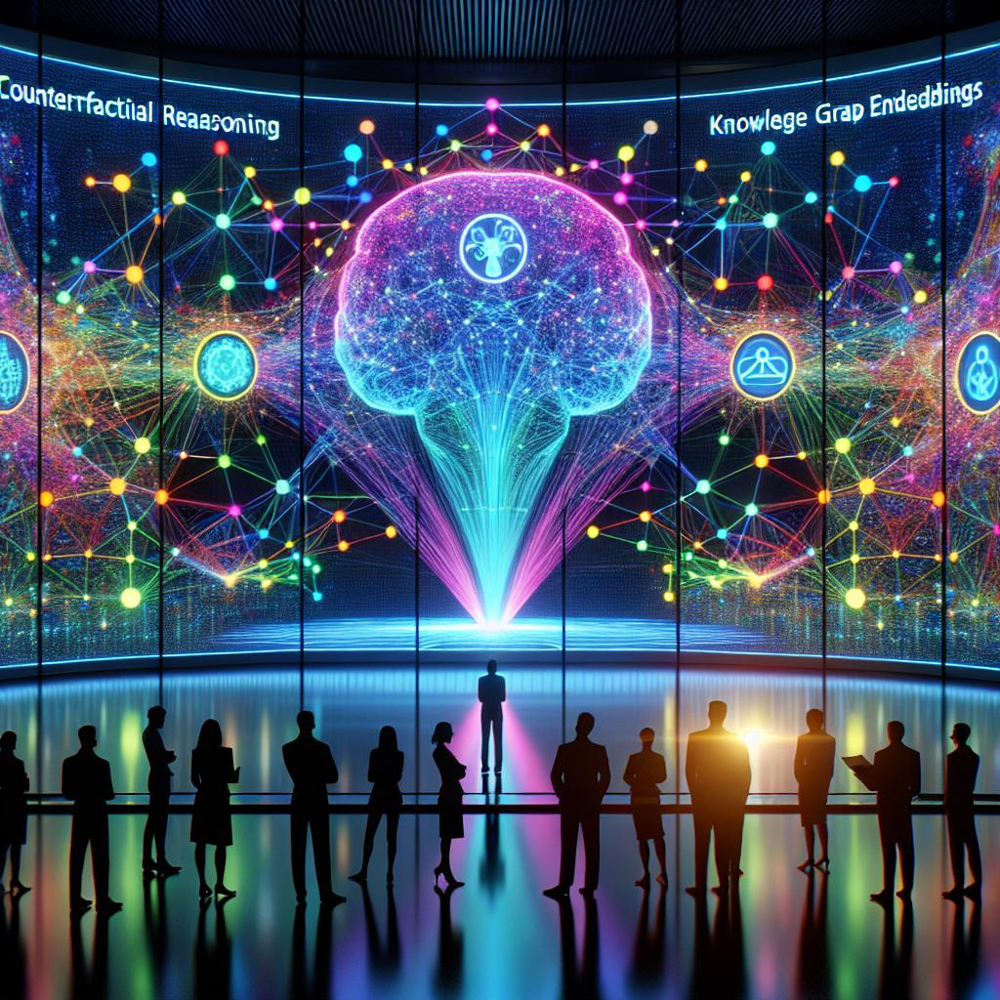

# Unveiling the Future of AI: Counterfactual Reasoning with Knowledge Graph Embeddings

The relentless pursuit of understanding and emulating human cognition has been a cornerstone in the evolution of Artificial Intelligence (AI). Among the numerous endeavors to model human-like reasoning, counterfactual reasoning — the contemplation of alternative realities and outcomes — stands out as a fascinating and complex challenge. Recently, a groundbreaking study titled "Counterfactual Reasoning with Knowledge Graph Embeddings" has emerged, shedding light on the potential of Knowledge Graph Embeddings (KGEs) to navigate the intricate web of counterfactual reasoning.

## A New Dawn for AI Reasoning

The paper introduces a novel task, CFKGR (Counter Factual KG Reasoning), that bridges the gap between counterfactual reasoning and knowledge graph completion (KGC). By creating diverse hypothetical scenarios with plausible changes to a knowledge graph (KG), the researchers unveil a new paradigm for AI reasoning.

The task outlines an original world state as a KG and then introduces hypothetical scenarios as edges added to this graph. The essence of CFKGR lies in the ability of models to discern plausible changes to the graph while preserving unaffected facts.

## Benchmarking Counterfactual Inference

To facilitate the evaluation of AI models in counterfactual reasoning, the study presents COULDD, a method that adapts existing KGEs based on a hypothetical premise. COULDD's effectiveness was illumination through evaluation on a specially designed benchmark, showcasing its potential in detecting plausible counterfactual changes and maintaining performance on unaffected triples.

## The AI's Encounter with Hypothetical Realities

In an intriguing finding, the AI models, particularly COULDD, demonstrated an aptitude for learning patterns in the KG without explicit training on counterfactuals. This ability underscores the inherent potential of AI to infer plausible counterfactual changes to the KG, following existing patterns.

However, the study also highlights a challenge: AI's struggle to recognize changes to the graph that do not comply with learned inference rules. This limitation points to the need for further advancements in AI's understanding and processing of counterfactual scenarios.

## Surpassing the Boundaries of AI Reasoning

This pioneering research not only opens new avenues for AI reasoning but also lays the groundwork for more sophisticated AI systems capable of navigating the complexities of the real world. The integration of counterfactual reasoning within AI models signifies a leap towards machines that can think, reason, and make decisions in ways that mimic human cognitive processes.

By delving into the realms of counterfactual reasoning with KGEs, we stand on the brink of a new era in AI, where machines could potentially understand and navigate alternate realities, making them more adaptable, insightful, and ultimately, more human-like.

The journey towards achieving this level of AI sophistication is fraught with challenges, but the rewards promise a future where AI can comprehend the nuances of human thought processes, opening up unprecedented possibilities for technology's role in our lives.

## In Conclusion

The study "Counterfactual Reasoning with Knowledge Graph Embeddings" represents a significant milestone in the quest to imbue AI with human-like reasoning capabilities. As we venture further into this fascinating territory, the collaboration between human insight and machine learning continues to unravel the untapped potentials of AI, setting the stage for revolutionary advancements in how we interact with and perceive technology.